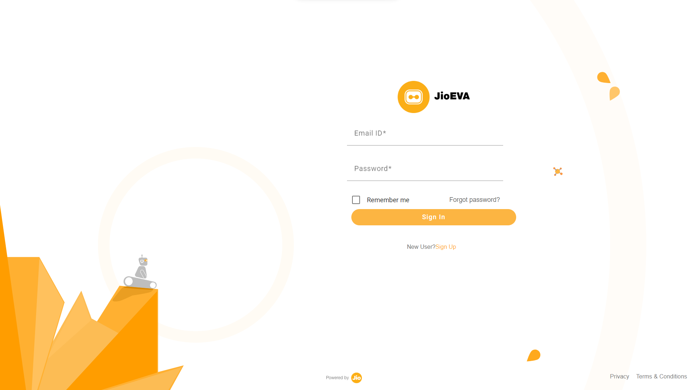
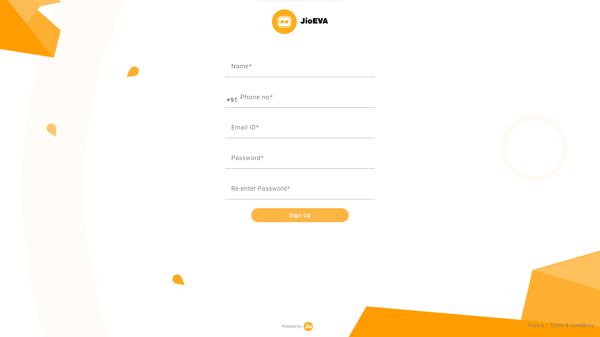

# JioEVA-login
login page similar to jioeva.ai/portal/login where for Frontend , I have used Angular + Material and for backend I have use Node js , express js and mongodb for storing data.

## Steps to implement:
### Running frontend
1. cd frontend
2. ng serve -o

### Running backend
1. cd backend
2. npm install -g nodemon
3. nodemon src/index.js

### To view user details
1. Download MongoDBCompass
2. open and connect to server uri : mongodb://localhost:27017
3. view details in JioEVA/users

## Screenshots:
### Login Page: 

### SignUp Page:

